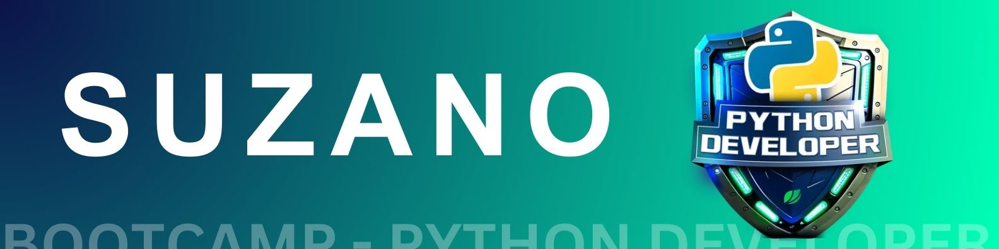
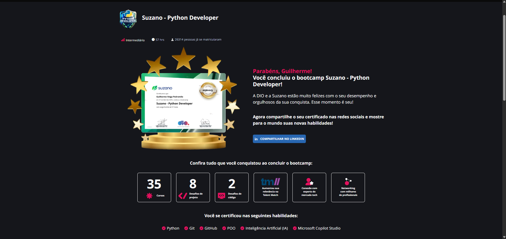

---

# Bootcamp - Suzano Python Developer
- Dê os primeiros passos rumo ao domínio da linguagem Python! Crie projetos - práticos, como um sistema bancário e soluções com inteligência artificial, - utilizando uma linguagem simples e poderosa. Prepare-se para o mercado com as - principais práticas atuais de produtividade com IA, Microsoft Copilot e Azure. Trilha do curso no GitHub - https://github.com/digitalinnovationone/trilha-python-dio.git

---

---

## 🚀 Desafios de Projeto

### 💼 Criando um Sistema Bancário com Python
- Neste projeto, você será desafiado a desenvolver um sistema bancário com três - operações principais: depósito, saque e extrato. O objetivo é simular operações - reais de um banco que visa monetizar suas funcionalidades.
Durante o desafio, você aplicará seus conhecimentos de Python para criar uma solução funcional, prática e eficiente.

- 📄 [Acesse o arquivo do desafio aqui!](./Sintaxe%20Básica%20com%20Python/Desafio%20de%20Projeto%20-%20Criando%20um%20Sistema%20Bancário%20com%20Python/desafio_criando_um_sistema_bancario_com_python.py)

### 📈 Otimizando o Sistema Bancário com Funções Python
- Neste desafio, você terá a oportunidade de otimizar o Sistema Bancário previamente desenvolvido com o uso de funções Python. O objetivo é aprimorar a estrutura e a eficiência do sistema, implementando as operações de depósito, saque e extrato em funções específicas. Você terá a chance de refatorar o código existente, dividindo-o em funções reutilizáveis, facilitando a manutenção e o entendimento do sistema como um todo. Prepare-se para aplicar conceitos avançados de programação e demonstrar sua habilidade em criar soluções mais elegantes e eficientes utilizando Python.

- 📄 [Acesse o arquivo do desafio aqui!](./Trabalhando%20com%20coleções%20em%20Python//DESAFIO%20-%20Otimizando%20o%20Sistema%20Bancário%20com%20Funções%20Python/desafio_otimizando_um_sistema_bancario_com_funcoes_python.py)

### 🏦 Modelando o Sistema Bancário em POO com Python
- Neste desafio iremos atualizar a implementação do sistema bancário, para armazenar os dados de clientes e contas bancárias em objetos ao invés de dicionários. O código deve seguir o modelo de classes UML:

---

---

- 📄 [Acesse o arquivo do desafio aqui!](./Programação%20Orientada%20a%20Objetos%20com%20Python/Desafio%20de%20projeto%20-%20Modelando%20o%20Sistema%20Bancário%20em%20POO%20com%20Python/desafio_de_projeto-modelando_o_sistema_bancario_em_poo_com_python.py)

### 🤖 Criando seu primeiro Copiloto no Microsoft Copilot Studio
- Aprenda a criar um copiloto no Microsoft Copilot Studio, abordando a configuração de fluxos de conversa, integração com serviços externos e personalização de respostas. Ao final, você terá um assistente funcional capaz de interagir de forma inteligente e automatizar tarefas.

- 📄 [Acesse o arquivo do desafio aqui!](./Produtividade%20com%20Microsoft%20Copilot/Desafio%20de%20Projeto%20-%20Criando%20seu%20primeiro%20Copiloto%20com%20Microsoft%20Copilot%20Studio/Desafio%20de%20Projeto%20-%20Criando%20seu%20primeiro%20Copiloto.md)

### 🗣️ Criando um Copiloto com Fluxo de Conversa Personalizado no Microsoft Copilot Studio

- Crie um Copilot com um fluxo de conversa personalizado no Microsoft Copilot Studio. Aprenda a iniciar um copiloto do zero, customizar um tópico, personalizar mensagens de erro e ajustar a qualidade das respostas utilizando GenAI. Ao final, você terá um copiloto otimizado para oferecer interações mais precisas e eficientes.

- 📄 [Acesse o arquivo do desafio aqui!](./Produtividade%20com%20Microsoft%20Copilot/Desafio%20de%20Projeto%20-%20Criando%20um%20Copiloto%20com%20Fluxo%20de%20Conversa%20Personalizado%20no%20Microsoft%20Copilot%20Studio/Desafio%20de%20Projeto%20-%20Criando%20um%20Copiloto.md)

### 🧠 Análise de Sentimentos com Language Studio no Azure AI

- Neste LAB, exploraremos o uso do Azure Speech Studio e a análise linguística proporcionada pelo Language Studio. Durante a prática, teremos a oportunidade de aprofundar nosso entendimento sobre como aproveitar essas ferramentas avançadas da Microsoft Azure. Estaremos focados em aprimorar nossas habilidades na implementação de soluções de análise de fala e linguagem, abrindo portas para uma compreensão mais ampla e prática das capacidades oferecidas por essas tecnologias inovadoras.

- 📄 [Acesse o arquivo do desafio aqui!](./Integrando%20com%20Serviços%20de%20IA/Desafio%20de%20Projeto%20-%20Análise%20de%20Sentimentos%20com%20Language%20Studio%20no%20Azure%20AI/Análise%20de%20Sentimentos%20com%20Language%20Studio%20no%20Azure%20AI.md)

## 📚 Conteúdos
### 🔰 Introdução ao Ambiente Python e Projetos Colaborativos
- Introdução ao Python com a Suzano
- Ambiente de Desenvolvimento e Primeiros Passos com Python
- Conhecendo a Linguagem de Programação Python
- Versionamento de Código com Git e GitHub
- Desafios de Projetos: Crie um Portfólio Vencedor
- Contribuindo em Projetos Open Source no GitHub
- Live de Lançamento: Suzano - Python Developer
### 🐍 Sintaxe Básica com Python
- Tipos de Operadores
- Estruturas Condicionais e de Repetição
- Manipulação de Strings
- Funções em Python
- Criando um Sistema Bancário com Python
- Trabalhando com Listas
- Tuplas
- Conjuntos
- Dicionários
- Manipulação de Data, Hora e Fuso Horário
- Otimizando o Sistema Bancário com Funções
- Desafios de Código: Lógica e Pensamento Computacional
- Gestão e Controle de Transações Bancárias
### 🧱 Programação Orientada a Objetos com Python
- Introdução à Programação Orientada a Objetos (POO)
- Herança
- Encapsulamento
- Polimorfismo
- Interfaces e Classes Abstratas
- Modelando o Sistema Bancário com POO
- Criando um Pacote de Processamento de Imagens
- Fundamentos de POO em Sistemas Bancário
### 🤖 Produtividade com Microsoft Copilot Studio
- Introdução ao Microsoft Copilot Studio
- Ambientes de Desenvolvimento
- Criando seu Primeiro Copiloto
- Trabalhando com Tópicos e Ramificações
- Tópicos de Fallback do Sistema
- Entidades e Variáveis
- Entidades Personalizadas e Variáveis
- Criando Respostas Generativas com IA
- Desenvolvendo um Fluxo de Conversa Personalizado
### 🌐 Integração com Serviços de IA
- Fundamentos da IA Generativa
- Conceitos Fundamentais de Inteligência Artificial
- Fundamentos de Aprendizado de Máquina
- Processamento de Linguagem Natural
- Análise de Sentimentos com Azure AI Language Studio
- Integração com Serviços Azure OpenAI